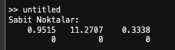

# Phase Space and Stability Analysis

This project includes MATLAB scripts and graphs related to phase space and stability analysis.

## Graphs

### x1-x2 Graphs

### Fixed Points

### Lyapunov Exponent

### Phase Space

### Jacobian and Lyapunov Fixed Points

### x1(t) and x1(t+9) Phase Space

### Time Series Graphs

