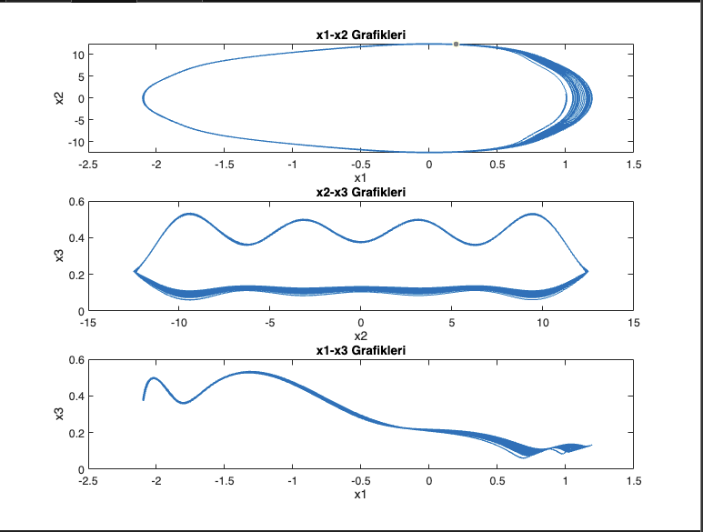

# Phase Space and Stability Analysis

This project includes MATLAB scripts and graphs related to phase space and stability analysis. It aims to explore the dynamics of different systems through visual representations such as phase space plots, fixed points, and Lyapunov exponents.

## Project Aim

The aim of this project is to analyze the stability and dynamics of different systems using various MATLAB scripts and graphical representations.

## Graphs

### x1-x2 Graphs

This graph represents the relationship between x1 and x2 in the phase space. It helps in visualizing the trajectory of the system in a two-dimensional space.

### Fixed Points

Fixed points are the points where the system remains constant over time. This graph shows the fixed points identified in the analysis.

### Lyapunov Exponent

The Lyapunov exponent measures the rate of separation of infinitesimally close trajectories. A positive Lyapunov exponent indicates chaos in the system. This graph shows the calculated Lyapunov exponent.

### Phase Space

Phase space is a multidimensional space in which all possible states of a system are represented. This graph illustrates the phase space of the system, showing its trajectory over time.

### Jacobian and Lyapunov Fixed Points

This graph shows the Jacobian matrix and Lyapunov exponents calculated at the fixed points. The Jacobian matrix helps in understanding the local stability of the fixed points.

### x1(t) and x1(t+9) Phase Space

This graph represents the phase space plot of x1(t) and x1(t+9). It shows the delayed phase space trajectory, which helps in understanding the system's dynamics over time delays.

### Time Series Graphs

Time series graphs show the evolution of system variables over time. This graph displays the time series of x1, providing insights into the system's temporal behavior.
